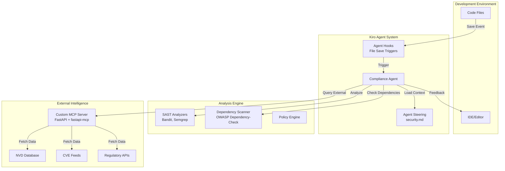

# Design Document

## Overview

The Compliance Sentinel is architected as a multi-layered, event-driven system that integrates deeply with Kiro's agentic capabilities. The system operates on a proactive enforcement model where security policies are continuously applied during development rather than as a post-development check. The architecture leverages three core Kiro features: Agent Steering for policy context, Agent Hooks for automated triggers, and Model Context Protocol (MCP) for external intelligence integration.

The system is built using Python 3.11 for stability and broad library compatibility, ensuring reliable operation in production environments. The design emphasizes modularity, extensibility, and minimal performance impact on the development workflow.

## Architecture

### High-Level Architecture



### Component Architecture

The system is organized into four primary layers:

1. **Policy Layer**: Centralized policy definition and management
2. **Trigger Layer**: Event-driven automation using Agent Hooks
3. **Analysis Layer**: Multi-tool security analysis engine
4. **Intelligence Layer**: External data integration via MCP

## Components and Interfaces

### 1. Policy Management Component

**Location**: `.kiro/steering/security.md`

**Purpose**: Serves as the single source of truth for all security and compliance policies.

**Interface**:
```python
class PolicyManager:
    def load_policies(self) -> Dict[str, PolicyRule]
    def validate_policy(self, policy: PolicyRule) -> ValidationResult
    def get_applicable_rules(self, file_type: str, context: str) -> List[PolicyRule]
```

**Key Features**:
- Markdown-based policy definition for human readability
- Automatic loading into Kiro's steering context
- Support for rule categorization (API security, credentials, dependencies)
- Policy validation and syntax checking

### 2. Agent Hook Manager

**Purpose**: Manages file save event triggers and coordinates analysis workflows.

**Interface**:
```python
class HookManager:
    def register_file_save_hook(self, patterns: List[str]) -> None
    def trigger_analysis(self, file_path: str, content: str) -> AnalysisResult
    def configure_hook_settings(self, settings: HookSettings) -> None
```

**Key Features**:
- File pattern matching for selective triggering
- Asynchronous analysis to prevent IDE blocking
- Configurable trigger conditions and thresholds
- Integration with Kiro's Agent Hook system

### 3. SAST Analysis Engine

**Purpose**: Orchestrates multiple static analysis tools for comprehensive security scanning.

**Components**:

#### Bandit Analyzer
```python
class BanditAnalyzer:
    def analyze_python_code(self, file_path: str) -> List[SecurityIssue]
    def get_severity_mapping(self) -> Dict[str, Severity]
    def configure_rules(self, custom_rules: List[str]) -> None
```

#### Semgrep Analyzer
```python
class SemgrepAnalyzer:
    def analyze_with_custom_rules(self, file_path: str, rules: List[str]) -> List[SecurityIssue]
    def load_organizational_rules(self) -> List[SemgrepRule]
    def validate_rule_syntax(self, rule: str) -> ValidationResult
```

#### Analysis Coordinator
```python
class AnalysisCoordinator:
    def run_comprehensive_scan(self, file_path: str) -> ComprehensiveResult
    def prioritize_issues(self, issues: List[SecurityIssue]) -> List[SecurityIssue]
    def generate_remediation_suggestions(self, issue: SecurityIssue) -> RemediationSuggestion
```

### 4. Dependency Security Scanner

**Purpose**: Analyzes project dependencies for known vulnerabilities.

**Interface**:
```python
class DependencyScanner:
    def scan_requirements_file(self, file_path: str) -> List[VulnerabilityReport]
    def check_against_nvd(self, package: str, version: str) -> VulnerabilityStatus
    def generate_upgrade_recommendations(self, vulnerabilities: List[VulnerabilityReport]) -> List[UpgradeRecommendation]
```

**Integration**:
- OWASP Dependency-Check for core vulnerability scanning
- Integration with MCP server for real-time vulnerability data
- Caching mechanism for performance optimization

### 5. Custom MCP Server

**Purpose**: Provides secure interface to external vulnerability databases and regulatory APIs.

**Technology Stack**:
- FastAPI for high-performance API framework
- fastapi-mcp for Kiro MCP integration
- Async/await for non-blocking external API calls

**Interface**:
```python
class MCPServer:
    def query_nvd_database(self, cve_id: str) -> VulnerabilityData
    def fetch_latest_cve_feeds(self) -> List[CVEEntry]
    def check_regulatory_compliance(self, code_pattern: str) -> ComplianceStatus
    def cache_vulnerability_data(self, data: VulnerabilityData, ttl: int) -> None
```

**API Endpoints**:
- `/vulnerabilities/search` - Search vulnerability databases
- `/compliance/check` - Validate against regulatory requirements
- `/dependencies/analyze` - Analyze dependency security status
- `/cache/status` - Monitor cache performance and health

### 6. Feedback and Remediation Engine

**Purpose**: Generates intelligent, actionable feedback for developers.

**Interface**:
```python
class FeedbackEngine:
    def generate_violation_report(self, issues: List[SecurityIssue]) -> ViolationReport
    def create_remediation_suggestions(self, issue: SecurityIssue) -> List[RemediationOption]
    def format_ide_feedback(self, report: ViolationReport) -> IDEFeedback
    def track_remediation_effectiveness(self, suggestion: RemediationOption, outcome: str) -> None
```

**Key Features**:
- Contextual code examples for remediation
- Severity-based prioritization
- Integration with IDE for inline feedback
- Learning from remediation outcomes

## Data Models

### Core Data Structures

```python
@dataclass
class SecurityIssue:
    id: str
    severity: Severity
    category: SecurityCategory
    file_path: str
    line_number: int
    description: str
    rule_id: str
    confidence: float
    remediation_suggestions: List[RemediationSuggestion]

@dataclass
class PolicyRule:
    id: str
    name: str
    description: str
    category: PolicyCategory
    severity: Severity
    pattern: str
    remediation_template: str
    applicable_file_types: List[str]

@dataclass
class VulnerabilityReport:
    cve_id: str
    package_name: str
    affected_versions: List[str]
    severity_score: float
    description: str
    remediation_available: bool
    upgrade_path: Optional[str]

@dataclass
class AnalysisResult:
    file_path: str
    timestamp: datetime
    issues: List[SecurityIssue]
    vulnerabilities: List[VulnerabilityReport]
    compliance_status: ComplianceStatus
    analysis_duration: float
    recommendations: List[str]
```

### Configuration Models

```python
@dataclass
class SystemConfiguration:
    python_version: str = "3.11"
    analysis_tools: List[str] = field(default_factory=lambda: ["bandit", "semgrep"])
    mcp_server_url: str = "http://localhost:8000"
    cache_ttl: int = 3600
    max_concurrent_analyses: int = 5
    severity_threshold: Severity = Severity.MEDIUM

@dataclass
class HookSettings:
    enabled_file_patterns: List[str]
    excluded_directories: List[str]
    analysis_timeout: int
    async_processing: bool = True
```

## Error Handling

### Graceful Degradation Strategy

The system implements a multi-tier error handling approach:

1. **External Service Failures**: When MCP server or external APIs are unavailable, the system continues with local analysis only
2. **Tool Failures**: If individual SAST tools fail, other tools continue processing
3. **Performance Issues**: Analysis operations have configurable timeouts with fallback to cached results
4. **Configuration Errors**: Invalid policies trigger validation warnings but don't block analysis

### Error Recovery Mechanisms

```python
class ErrorHandler:
    def handle_external_service_failure(self, service: str, error: Exception) -> FallbackStrategy
    def retry_with_exponential_backoff(self, operation: Callable, max_retries: int = 3) -> Any
    def log_and_continue(self, error: Exception, context: str) -> None
    def escalate_critical_error(self, error: CriticalError) -> None
```

## Testing Strategy

### Unit Testing Approach

- **Policy Engine Tests**: Validate policy parsing, rule application, and configuration management
- **Analysis Engine Tests**: Mock external dependencies and test each SAST tool integration
- **MCP Server Tests**: Test API endpoints, caching mechanisms, and error handling
- **Integration Tests**: End-to-end workflow testing with sample codebases

### Test Data Management

```python
class TestDataManager:
    def create_vulnerable_code_samples(self) -> Dict[str, str]
    def generate_mock_vulnerability_data(self) -> List[VulnerabilityReport]
    def setup_test_policies(self) -> PolicyConfiguration
    def cleanup_test_artifacts(self) -> None
```

### Performance Testing

- **Load Testing**: Simulate multiple concurrent file saves and analysis requests
- **Memory Profiling**: Monitor memory usage during large codebase analysis
- **Response Time Testing**: Ensure sub-second feedback for typical code changes
- **Cache Effectiveness**: Measure cache hit rates and performance improvements

### Security Testing

- **Input Validation**: Test policy parsing with malformed inputs
- **API Security**: Validate MCP server authentication and authorization
- **Data Sanitization**: Ensure no sensitive code data leaks to external services
- **Privilege Escalation**: Verify system operates with minimal required permissions

## Performance Considerations

### Optimization Strategies

1. **Asynchronous Processing**: All analysis operations run asynchronously to prevent IDE blocking
2. **Intelligent Caching**: Multi-layer caching for vulnerability data, analysis results, and policy rules
3. **Incremental Analysis**: Only analyze changed code sections when possible
4. **Resource Pooling**: Reuse analysis tool instances to reduce initialization overhead

### Scalability Design

```python
class PerformanceOptimizer:
    def enable_incremental_analysis(self, file_diff: FileDiff) -> AnalysisScope
    def manage_analysis_queue(self, max_concurrent: int) -> QueueManager
    def optimize_cache_strategy(self, usage_patterns: UsageMetrics) -> CacheConfiguration
    def monitor_system_resources(self) -> ResourceMetrics
```

### Resource Management

- **Memory Management**: Configurable limits for analysis result caching
- **CPU Throttling**: Adaptive analysis scheduling based on system load
- **Network Optimization**: Batch external API calls and implement request deduplication
- **Storage Optimization**: Compressed storage for historical analysis data