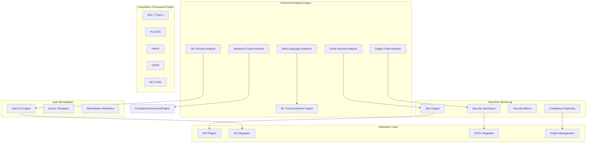

# Enhanced Security Rules Design Document

## Overview

The Enhanced Security Rules system extends the Compliance Sentinel with advanced multi-language security analysis, AI-powered threat detection, and comprehensive compliance framework integration. The design emphasizes scalability, extensibility, and real-time performance while maintaining the existing system's reliability and ease of use.

The enhancement introduces a plugin-based architecture for language-specific analyzers, machine learning models for anomaly detection, and a comprehensive rule engine that can adapt to emerging threats and compliance requirements.

## Architecture

### High-Level Architecture



### Component Architecture

The enhanced system is organized into six primary layers:

1. **Multi-Language Analysis Layer**: Language-specific security analyzers
2. **Advanced Detection Layer**: ML-powered threat detection and crypto analysis
3. **Compliance Layer**: Framework-specific compliance checking
4. **Monitoring Layer**: Real-time alerting and dashboard systems
5. **Remediation Layer**: Automated fixing and secure template generation
6. **Integration Layer**: Development ecosystem integrations

## Components and Interfaces

### 1. Multi-Language Security Analyzers

**Purpose**: Provide comprehensive security analysis for multiple programming languages with language-specific vulnerability detection.

#### JavaScript/TypeScript Analyzer
```python
class JavaScriptAnalyzer(SecurityAnalyzer):
    def analyze_xss_vulnerabilities(self, ast_node: ASTNode) -> List[SecurityIssue]
    def detect_prototype_pollution(self, code: str) -> List[SecurityIssue]
    def check_npm_vulnerabilities(self, package_json: str) -> List[VulnerabilityReport]
    def analyze_async_patterns(self, code: str) -> List[SecurityIssue]
    def detect_dom_manipulation_flaws(self, code: str) -> List[SecurityIssue]
```

#### Java Analyzer
```python
class JavaAnalyzer(SecurityAnalyzer):
    def detect_deserialization_flaws(self, code: str) -> List[SecurityIssue]
    def analyze_xxe_vulnerabilities(self, xml_code: str) -> List[SecurityIssue]
    def check_spring_security_config(self, config: str) -> List[SecurityIssue]
    def detect_reflection_vulnerabilities(self, code: str) -> List[SecurityIssue]
    def analyze_jndi_injection(self, code: str) -> List[SecurityIssue]
```

#### C# Analyzer
```python
class CSharpAnalyzer(SecurityAnalyzer):
    def detect_unsafe_deserialization(self, code: str) -> List[SecurityIssue]
    def analyze_sql_injection_patterns(self, code: str) -> List[SecurityIssue]
    def check_dotnet_security_config(self, config: str) -> List[SecurityIssue]
    def detect_xaml_injection(self, xaml_code: str) -> List[SecurityIssue]
    def analyze_wcf_security(self, config: str) -> List[SecurityIssue]
```

### 2. Advanced Cryptographic Security Analyzer

**Purpose**: Deep analysis of cryptographic implementations and security protocols.

```python
class AdvancedCryptoAnalyzer:
    def analyze_key_generation(self, code: str) -> List[CryptoIssue]
    def check_iv_usage_patterns(self, code: str) -> List[CryptoIssue]
    def detect_padding_oracle_vulnerabilities(self, code: str) -> List[CryptoIssue]
    def analyze_certificate_validation(self, code: str) -> List[CryptoIssue]
    def check_random_number_generation(self, code: str) -> List[CryptoIssue]
    def detect_timing_attack_vulnerabilities(self, code: str) -> List[CryptoIssue]
    def analyze_signature_verification(self, code: str) -> List[CryptoIssue]
```

**Key Features**:
- Entropy analysis for random number generation
- Certificate chain validation checking
- Side-channel attack detection
- Cryptographic protocol implementation analysis
- Key management best practices validation

### 3. Cloud Security Analyzer

**Purpose**: Analyze infrastructure-as-code and cloud configurations for security vulnerabilities.

```python
class CloudSecurityAnalyzer:
    def analyze_dockerfile(self, dockerfile: str) -> List[SecurityIssue]
    def check_kubernetes_manifests(self, manifests: List[str]) -> List[SecurityIssue]
    def analyze_terraform_config(self, tf_files: List[str]) -> List[SecurityIssue]
    def check_cloudformation_template(self, template: str) -> List[SecurityIssue]
    def analyze_docker_compose(self, compose_file: str) -> List[SecurityIssue]
```

**Analysis Capabilities**:
- Container security best practices
- Network security configurations
- IAM policy analysis
- Encryption and key management
- Resource access controls

### 4. Machine Learning Threat Detection Engine

**Purpose**: Use AI/ML algorithms to detect complex attack patterns and anomalous code structures.

```python
class MLThreatDetectionEngine:
    def __init__(self):
        self.anomaly_detector = AnomalyDetectionModel()
        self.pattern_classifier = ThreatPatternClassifier()
        self.behavioral_analyzer = BehavioralAnalyzer()
    
    def detect_code_anomalies(self, code: str, context: CodeContext) -> List[AnomalyReport]
    def classify_threat_patterns(self, code_features: CodeFeatures) -> ThreatClassification
    def analyze_commit_behavior(self, commit_history: List[Commit]) -> BehavioralAnalysis
    def detect_backdoor_patterns(self, code: str) -> List[BackdoorIndicator]
    def analyze_data_flow_anomalies(self, data_flow: DataFlowGraph) -> List[DataFlowAnomaly]
```

**ML Models**:
- Unsupervised anomaly detection for unusual code patterns
- Supervised classification for known threat patterns
- Behavioral analysis for insider threat detection
- Natural language processing for comment and string analysis
- Graph neural networks for code structure analysis

### 5. Compliance Framework Engine

**Purpose**: Automated compliance checking against multiple security and regulatory frameworks.

```python
class ComplianceFrameworkEngine:
    def __init__(self):
        self.frameworks = {
            'soc2': SOC2ComplianceChecker(),
            'pci_dss': PCIDSSComplianceChecker(),
            'hipaa': HIPAAComplianceChecker(),
            'gdpr': GDPRComplianceChecker(),
            'iso27001': ISO27001ComplianceChecker()
        }
    
    def check_compliance(self, code: str, framework: str) -> ComplianceReport
    def generate_compliance_report(self, results: List[ComplianceResult]) -> ComplianceReport
    def track_compliance_metrics(self, historical_data: List[ComplianceResult]) -> ComplianceMetrics
```

#### Framework-Specific Checkers

**SOC 2 Type II Checker**:
```python
class SOC2ComplianceChecker:
    def check_access_controls(self, code: str) -> List[ComplianceIssue]
    def verify_data_encryption(self, code: str) -> List[ComplianceIssue]
    def check_audit_logging(self, code: str) -> List[ComplianceIssue]
    def verify_change_management(self, code: str) -> List[ComplianceIssue]
```

**PCI DSS Checker**:
```python
class PCIDSSComplianceChecker:
    def check_cardholder_data_protection(self, code: str) -> List[ComplianceIssue]
    def verify_encryption_requirements(self, code: str) -> List[ComplianceIssue]
    def check_access_restrictions(self, code: str) -> List[ComplianceIssue]
    def verify_security_testing(self, code: str) -> List[ComplianceIssue]
```

### 6. Real-time Monitoring and Alerting System

**Purpose**: Provide real-time security monitoring with intelligent alerting and dashboard capabilities.

```python
class SecurityMonitoringSystem:
    def __init__(self):
        self.alert_engine = AlertEngine()
        self.dashboard = SecurityDashboard()
        self.metrics_collector = SecurityMetricsCollector()
        self.report_generator = ComplianceReportGenerator()
    
    def process_security_event(self, event: SecurityEvent) -> None
    def generate_real_time_alerts(self, issues: List[SecurityIssue]) -> List[Alert]
    def update_security_metrics(self, analysis_result: AnalysisResult) -> None
    def create_executive_dashboard(self, time_period: TimePeriod) -> Dashboard
```

**Alert Engine**:
```python
class AlertEngine:
    def send_critical_alert(self, issue: SecurityIssue, channels: List[AlertChannel]) -> None
    def create_trend_alert(self, trend: SecurityTrend) -> Alert
    def generate_compliance_alert(self, violation: ComplianceViolation) -> Alert
    def escalate_unresolved_issues(self, issues: List[SecurityIssue]) -> None
```

### 7. Auto-Remediation Engine

**Purpose**: Provide intelligent auto-fixing capabilities and secure code generation.

```python
class AutoRemediationEngine:
    def __init__(self):
        self.fix_generator = SecurityFixGenerator()
        self.template_engine = SecureTemplateEngine()
        self.workflow_manager = RemediationWorkflowManager()
    
    def generate_automatic_fixes(self, issue: SecurityIssue) -> List[AutoFix]
    def create_secure_code_templates(self, context: CodeContext) -> List[SecureTemplate]
    def execute_remediation_workflow(self, workflow: RemediationWorkflow) -> WorkflowResult
```

**Fix Generation Strategies**:
- Pattern-based replacements for common vulnerabilities
- Context-aware code generation using AI models
- Secure configuration template generation
- Automated dependency upgrade recommendations
- Code refactoring suggestions for security improvements

### 8. Development Ecosystem Integration

**Purpose**: Seamless integration with development tools and workflows.

#### IDE Integration
```python
class IDEIntegration:
    def provide_real_time_feedback(self, code: str, cursor_position: int) -> List[SecuritySuggestion]
    def generate_code_completions(self, context: CodeContext) -> List[SecureCompletion]
    def create_inline_documentation(self, security_issue: SecurityIssue) -> InlineDoc
    def highlight_security_issues(self, code: str) -> List[SecurityHighlight]
```

#### Git Integration
```python
class GitIntegration:
    def analyze_pull_request(self, pr: PullRequest) -> PRSecurityAnalysis
    def create_security_review_comments(self, issues: List[SecurityIssue]) -> List[ReviewComment]
    def block_insecure_merges(self, merge_request: MergeRequest) -> MergeDecision
    def track_security_debt(self, repository: Repository) -> SecurityDebtReport
```

## Data Models

### Enhanced Security Issue Model

```python
@dataclass
class EnhancedSecurityIssue(SecurityIssue):
    # Existing fields from base SecurityIssue
    
    # Enhanced fields
    language: ProgrammingLanguage
    complexity_score: float
    exploitability_score: float
    business_impact: BusinessImpact
    compliance_frameworks: List[ComplianceFramework]
    ml_confidence: Optional[float]
    threat_classification: Optional[ThreatClassification]
    remediation_complexity: RemediationComplexity
    auto_fixable: bool
    related_issues: List[str]  # IDs of related issues
    historical_occurrences: int
    first_detected: datetime
    last_updated: datetime
```

### ML Analysis Models

```python
@dataclass
class AnomalyReport:
    anomaly_id: str
    anomaly_type: AnomalyType
    confidence_score: float
    code_snippet: str
    context: CodeContext
    similar_patterns: List[str]
    risk_assessment: RiskAssessment
    recommended_actions: List[str]

@dataclass
class ThreatClassification:
    threat_type: ThreatType
    attack_vector: AttackVector
    severity_prediction: float
    confidence: float
    similar_threats: List[str]
    mitigation_strategies: List[str]
```

### Compliance Models

```python
@dataclass
class ComplianceReport:
    framework: ComplianceFramework
    overall_score: float
    compliant_controls: List[str]
    non_compliant_controls: List[ComplianceViolation]
    recommendations: List[ComplianceRecommendation]
    certification_readiness: CertificationReadiness
    audit_trail: List[AuditEntry]

@dataclass
class ComplianceViolation:
    control_id: str
    control_name: str
    violation_type: ViolationType
    severity: ComplianceSeverity
    description: str
    evidence: List[Evidence]
    remediation_steps: List[str]
    deadline: Optional[datetime]
```

## Performance Considerations

### Scalability Architecture

```python
class PerformanceOptimizer:
    def enable_parallel_language_analysis(self, files: List[str]) -> AnalysisStrategy
    def optimize_ml_model_inference(self, batch_size: int) -> MLOptimizationStrategy
    def implement_intelligent_caching(self, cache_strategy: CacheStrategy) -> CacheManager
    def manage_resource_allocation(self, analysis_load: AnalysisLoad) -> ResourceAllocation
```

**Optimization Strategies**:
1. **Parallel Processing**: Language-specific analyzers run in parallel
2. **ML Model Optimization**: Batch processing and model quantization
3. **Intelligent Caching**: Multi-level caching with smart invalidation
4. **Resource Management**: Dynamic resource allocation based on analysis complexity
5. **Incremental Analysis**: Only analyze changed code sections
6. **Distributed Processing**: Support for distributed analysis across multiple nodes

### Real-time Performance

- **Sub-second Analysis**: Target <500ms for typical file analysis
- **Streaming Processing**: Real-time analysis of code changes
- **Progressive Enhancement**: Basic analysis first, advanced analysis in background
- **Adaptive Throttling**: Adjust analysis depth based on system load
- **Predictive Caching**: Pre-analyze likely code changes

## Security and Privacy

### Data Protection

```python
class DataProtectionManager:
    def anonymize_code_samples(self, code: str) -> AnonymizedCode
    def encrypt_sensitive_analysis_data(self, data: AnalysisData) -> EncryptedData
    def manage_data_retention(self, retention_policy: RetentionPolicy) -> None
    def ensure_gdpr_compliance(self, user_data: UserData) -> ComplianceStatus
```

**Privacy Features**:
- Code anonymization for ML training
- Encrypted storage of analysis results
- Configurable data retention policies
- GDPR-compliant data handling
- Audit logging for all data access

### Threat Model

**Protected Assets**:
- Source code and intellectual property
- Security analysis results and patterns
- Compliance reports and audit data
- ML models and training data
- User authentication and authorization data

**Threat Vectors**:
- Malicious code injection in analysis pipeline
- Data exfiltration through analysis results
- Model poisoning attacks on ML components
- Privilege escalation through integration APIs
- Side-channel attacks on cryptographic analysis

## Testing Strategy

### Comprehensive Testing Framework

```python
class EnhancedTestingFramework:
    def create_multi_language_test_suite(self) -> TestSuite
    def generate_ml_model_validation_tests(self) -> MLTestSuite
    def create_compliance_framework_tests(self) -> ComplianceTestSuite
    def build_performance_benchmark_tests(self) -> PerformanceBenchmarks
    def create_security_penetration_tests(self) -> SecurityTestSuite
```

**Testing Approaches**:
1. **Language-Specific Testing**: Comprehensive test suites for each supported language
2. **ML Model Validation**: Accuracy, precision, recall, and bias testing
3. **Compliance Testing**: Validation against real compliance requirements
4. **Performance Testing**: Load testing, stress testing, and scalability testing
5. **Security Testing**: Penetration testing and vulnerability assessment
6. **Integration Testing**: End-to-end testing of all system integrations

### Continuous Validation

- **Automated Regression Testing**: Continuous validation of detection accuracy
- **A/B Testing**: Compare different analysis strategies and ML models
- **Canary Deployments**: Gradual rollout of new detection capabilities
- **Feedback Loop Integration**: Learn from user feedback and false positives
- **Benchmark Tracking**: Monitor performance metrics over time

## Deployment and Operations

### Deployment Architecture

```python
class DeploymentManager:
    def deploy_language_analyzers(self, analyzers: List[LanguageAnalyzer]) -> DeploymentResult
    def update_ml_models(self, models: List[MLModel]) -> UpdateResult
    def configure_compliance_frameworks(self, frameworks: List[ComplianceFramework]) -> ConfigResult
    def setup_monitoring_infrastructure(self, monitoring_config: MonitoringConfig) -> MonitoringResult
```

**Deployment Strategies**:
- **Microservices Architecture**: Independent deployment of language analyzers
- **Container-Based Deployment**: Docker containers for consistent environments
- **Blue-Green Deployment**: Zero-downtime updates for critical components
- **Feature Flags**: Gradual rollout of new capabilities
- **Auto-Scaling**: Dynamic scaling based on analysis load

### Operational Excellence

- **Health Monitoring**: Comprehensive health checks for all components
- **Performance Metrics**: Real-time monitoring of analysis performance
- **Error Tracking**: Detailed error logging and alerting
- **Capacity Planning**: Predictive scaling based on usage patterns
- **Disaster Recovery**: Backup and recovery procedures for all data