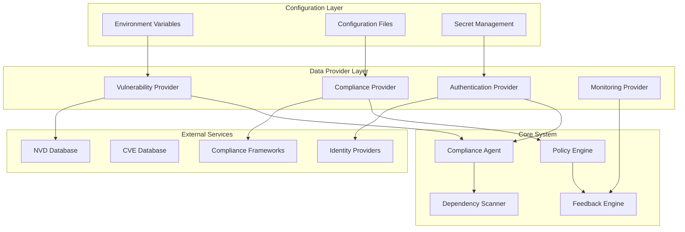
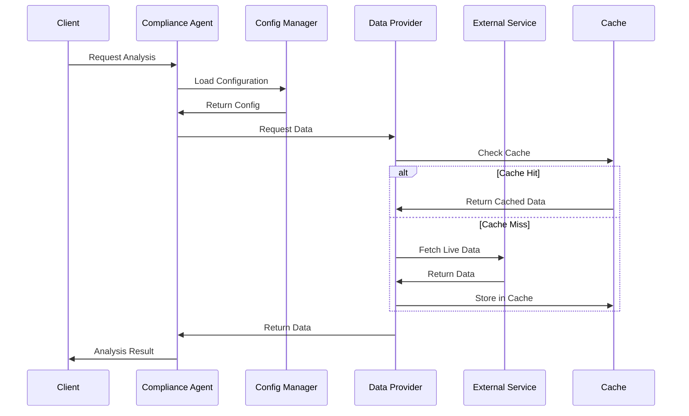

# Design Document

## Overview

This design document outlines the architecture and implementation strategy for removing hardcoded data from the Compliance Sentinel system and implementing real-time data integration capabilities. The solution focuses on creating a flexible, environment-aware system that can adapt to different deployment scenarios while maintaining security and performance.

## Architecture

### High-Level Architecture

The real-time data integration system will be built around several key architectural patterns:

1. **Configuration-Driven Architecture**: All system behavior controlled by external configuration
2. **Provider Pattern**: Pluggable data sources for different environments
3. **Cache-Aside Pattern**: Intelligent caching with configurable TTL and fallback strategies
4. **Circuit Breaker Pattern**: Resilient external service integration
5. **Observer Pattern**: Real-time data change notifications



### Data Flow Architecture



## Components and Interfaces

### 1. Configuration Management System

#### Enhanced ConfigManager

```python
class DynamicConfigManager:
    """Enhanced configuration manager with real-time updates."""
    
    def __init__(self, config_sources: List[ConfigSource]):
        self.config_sources = config_sources
        self.config_cache = {}
        self.watchers = {}
        self.reload_callbacks = {}
    
    async def get_config(self, key: str, default: Any = None) -> Any:
        """Get configuration value with environment variable override."""
        
    async def watch_config(self, key: str, callback: Callable) -> None:
        """Watch for configuration changes."""
        
    async def reload_config(self, source: str = None) -> None:
        """Reload configuration from sources."""
```

#### Configuration Sources

```python
class ConfigSource(ABC):
    """Abstract base for configuration sources."""
    
    @abstractmethod
    async def load_config(self) -> Dict[str, Any]:
        """Load configuration from source."""
        
    @abstractmethod
    async def watch_changes(self, callback: Callable) -> None:
        """Watch for configuration changes."""

class EnvironmentConfigSource(ConfigSource):
    """Environment variable configuration source."""
    
class FileConfigSource(ConfigSource):
    """File-based configuration source."""
    
class SecretManagerConfigSource(ConfigSource):
    """Secret management system integration."""
```

### 2. Data Provider System

#### Provider Interface

```python
class DataProvider(ABC):
    """Abstract base for data providers."""
    
    @abstractmethod
    async def initialize(self, config: Dict[str, Any]) -> None:
        """Initialize provider with configuration."""
        
    @abstractmethod
    async def get_data(self, request: DataRequest) -> DataResponse:
        """Fetch data based on request."""
        
    @abstractmethod
    async def health_check(self) -> HealthStatus:
        """Check provider health."""

class VulnerabilityDataProvider(DataProvider):
    """Provider for vulnerability data from multiple sources."""
    
    async def get_vulnerabilities(self, package: str, version: str) -> List[Vulnerability]:
        """Get vulnerabilities for specific package version."""
        
    async def search_vulnerabilities(self, query: str) -> List[Vulnerability]:
        """Search vulnerabilities by query."""

class ComplianceDataProvider(DataProvider):
    """Provider for compliance framework data."""
    
    async def get_framework_requirements(self, framework: str) -> List[Requirement]:
        """Get requirements for compliance framework."""
        
    async def check_compliance(self, code_patterns: List[str], framework: str) -> ComplianceResult:
        """Check code compliance against framework."""
```

#### Circuit Breaker Implementation

```python
class CircuitBreaker:
    """Circuit breaker for external service calls."""
    
    def __init__(self, failure_threshold: int, recovery_timeout: int):
        self.failure_threshold = failure_threshold
        self.recovery_timeout = recovery_timeout
        self.failure_count = 0
        self.last_failure_time = None
        self.state = CircuitState.CLOSED
    
    async def call(self, func: Callable, *args, **kwargs) -> Any:
        """Execute function with circuit breaker protection."""
        
    def _should_attempt_reset(self) -> bool:
        """Check if circuit should attempt reset."""
        
    def _on_success(self) -> None:
        """Handle successful call."""
        
    def _on_failure(self) -> None:
        """Handle failed call."""
```

### 3. Intelligent Caching System

#### Multi-Level Cache

```python
class IntelligentCache:
    """Multi-level cache with TTL and invalidation strategies."""
    
    def __init__(self, config: CacheConfig):
        self.l1_cache = {}  # In-memory cache
        self.l2_cache = None  # Redis/external cache
        self.config = config
        self.metrics = CacheMetrics()
    
    async def get(self, key: str, fetch_func: Callable = None) -> Any:
        """Get value with cache-aside pattern."""
        
    async def set(self, key: str, value: Any, ttl: int = None) -> None:
        """Set value in cache with TTL."""
        
    async def invalidate_pattern(self, pattern: str) -> None:
        """Invalidate cache entries matching pattern."""
        
    def get_metrics(self) -> CacheMetrics:
        """Get cache performance metrics."""

class CacheConfig:
    """Configuration for caching behavior."""
    
    def __init__(self):
        self.default_ttl = 3600
        self.max_memory_mb = 100
        self.eviction_policy = "LRU"
        self.compression_enabled = True
        self.redis_url = None
```

### 4. Real-Time Data Synchronization

#### Data Synchronizer

```python
class DataSynchronizer:
    """Manages real-time data synchronization."""
    
    def __init__(self, providers: List[DataProvider], cache: IntelligentCache):
        self.providers = providers
        self.cache = cache
        self.sync_tasks = {}
        self.update_callbacks = {}
    
    async def start_sync(self, data_type: str, interval: int) -> None:
        """Start periodic data synchronization."""
        
    async def stop_sync(self, data_type: str) -> None:
        """Stop data synchronization."""
        
    async def force_sync(self, data_type: str) -> None:
        """Force immediate data synchronization."""
        
    def register_update_callback(self, data_type: str, callback: Callable) -> None:
        """Register callback for data updates."""

class DataUpdateEvent:
    """Event for data updates."""
    
    def __init__(self, data_type: str, old_data: Any, new_data: Any):
        self.data_type = data_type
        self.old_data = old_data
        self.new_data = new_data
        self.timestamp = datetime.utcnow()
```

### 5. Environment-Aware Authentication

#### Authentication Provider

```python
class AuthenticationProvider(ABC):
    """Abstract authentication provider."""
    
    @abstractmethod
    async def authenticate(self, credentials: Dict[str, Any]) -> AuthResult:
        """Authenticate user with credentials."""
        
    @abstractmethod
    async def validate_token(self, token: str) -> TokenValidation:
        """Validate authentication token."""

class EnvironmentAuthProvider(AuthenticationProvider):
    """Environment-specific authentication provider."""
    
    def __init__(self, config: AuthConfig):
        self.config = config
        self.jwt_handler = JWTHandler(config.jwt_secret)
        self.api_key_manager = APIKeyManager(config.api_key_config)
    
    async def authenticate(self, credentials: Dict[str, Any]) -> AuthResult:
        """Authenticate based on environment configuration."""

class AuthConfig:
    """Authentication configuration."""
    
    def __init__(self):
        self.auth_type = "jwt"  # jwt, api_key, oauth, none
        self.jwt_secret = None
        self.jwt_expiry = 3600
        self.api_key_config = {}
        self.oauth_config = {}
        self.rate_limit_config = {}
```

## Data Models

### Configuration Models

```python
@dataclass
class EnvironmentConfig:
    """Environment-specific configuration."""
    environment: str  # dev, staging, prod
    debug_enabled: bool
    log_level: str
    external_services: Dict[str, ServiceConfig]
    cache_config: CacheConfig
    auth_config: AuthConfig
    monitoring_config: MonitoringConfig

@dataclass
class ServiceConfig:
    """External service configuration."""
    base_url: str
    api_key: Optional[str]
    timeout: int
    retry_config: RetryConfig
    circuit_breaker_config: CircuitBreakerConfig
    rate_limit: RateLimitConfig

@dataclass
class RetryConfig:
    """Retry configuration for external services."""
    max_attempts: int = 3
    backoff_factor: float = 2.0
    max_delay: int = 60
    retry_on_status: List[int] = field(default_factory=lambda: [500, 502, 503, 504])
```

### Data Models

```python
@dataclass
class Vulnerability:
    """Real-time vulnerability data model."""
    cve_id: str
    package_name: str
    affected_versions: List[str]
    severity: Severity
    cvss_score: float
    description: str
    published_date: datetime
    last_modified: datetime
    references: List[str]
    fix_available: bool
    fixed_versions: List[str]
    source: str  # nvd, cve, github, etc.

@dataclass
class ComplianceRequirement:
    """Dynamic compliance requirement."""
    framework: str  # owasp, nist, pci-dss, etc.
    requirement_id: str
    title: str
    description: str
    category: str
    severity: Severity
    test_patterns: List[str]
    remediation_guidance: str
    last_updated: datetime
    source_url: str
```

## Error Handling

### Resilient Error Handling

```python
class ResilientErrorHandler:
    """Enhanced error handler with fallback strategies."""
    
    def __init__(self, config: ErrorHandlingConfig):
        self.config = config
        self.circuit_breakers = {}
        self.fallback_strategies = {}
    
    async def handle_external_service_error(
        self, 
        service: str, 
        error: Exception,
        fallback_data: Any = None
    ) -> ErrorHandlingResult:
        """Handle external service errors with fallbacks."""
        
    async def handle_configuration_error(
        self, 
        config_key: str, 
        error: Exception
    ) -> Any:
        """Handle configuration loading errors."""
        
    def register_fallback_strategy(
        self, 
        error_type: Type[Exception], 
        strategy: Callable
    ) -> None:
        """Register fallback strategy for error type."""

@dataclass
class ErrorHandlingConfig:
    """Configuration for error handling behavior."""
    enable_circuit_breakers: bool = True
    enable_fallbacks: bool = True
    log_errors: bool = True
    alert_on_errors: bool = False
    fallback_cache_ttl: int = 300
    max_fallback_age: int = 3600
```

## Testing Strategy

### Test Data Management

```python
class TestDataManager:
    """Manages test data separately from production code."""
    
    def __init__(self, environment: str):
        self.environment = environment
        self.test_data_enabled = environment in ["test", "development"]
    
    def get_test_vulnerabilities(self) -> List[Vulnerability]:
        """Get test vulnerability data."""
        if not self.test_data_enabled:
            raise RuntimeError("Test data not available in production")
        return self._load_test_vulnerabilities()
    
    def get_mock_compliance_data(self) -> List[ComplianceRequirement]:
        """Get mock compliance data for testing."""
        if not self.test_data_enabled:
            raise RuntimeError("Mock data not available in production")
        return self._load_mock_compliance_data()

class ProductionDataValidator:
    """Validates that production code doesn't use test data."""
    
    def validate_no_test_data(self, code_path: str) -> List[ValidationError]:
        """Validate that code doesn't contain test data references."""
        
    def validate_environment_separation(self, config: EnvironmentConfig) -> List[ValidationError]:
        """Validate proper environment separation."""
```

### Integration Testing

```python
class RealTimeDataIntegrationTest:
    """Integration tests for real-time data functionality."""
    
    async def test_vulnerability_data_fetch(self):
        """Test real vulnerability data fetching."""
        
    async def test_configuration_hot_reload(self):
        """Test configuration hot reloading."""
        
    async def test_cache_invalidation(self):
        """Test cache invalidation strategies."""
        
    async def test_circuit_breaker_behavior(self):
        """Test circuit breaker functionality."""
        
    async def test_fallback_mechanisms(self):
        """Test fallback mechanisms when services are down."""
```

## Performance Considerations

### Optimization Strategies

1. **Lazy Loading**: Load configuration and data only when needed
2. **Connection Pooling**: Reuse connections to external services
3. **Batch Processing**: Batch requests to external APIs
4. **Compression**: Compress cached data to reduce memory usage
5. **Async Processing**: Use async/await for all I/O operations

### Monitoring and Metrics

```python
class RealTimeMetrics:
    """Metrics for real-time data integration."""
    
    def __init__(self):
        self.config_reload_count = 0
        self.cache_hit_rate = 0.0
        self.external_service_latency = {}
        self.circuit_breaker_trips = {}
        self.fallback_usage = {}
    
    def record_config_reload(self, source: str) -> None:
        """Record configuration reload event."""
        
    def record_cache_access(self, hit: bool) -> None:
        """Record cache access for hit rate calculation."""
        
    def record_service_latency(self, service: str, latency_ms: float) -> None:
        """Record external service latency."""
        
    def get_health_metrics(self) -> Dict[str, Any]:
        """Get system health metrics."""
```

## Security Considerations

### Secure Configuration Management

1. **Secret Rotation**: Support for automatic secret rotation
2. **Encryption**: Encrypt sensitive configuration values
3. **Access Control**: Role-based access to configuration
4. **Audit Logging**: Log all configuration changes
5. **Validation**: Validate configuration values for security

### Data Privacy

1. **Data Minimization**: Only fetch required data
2. **Retention Policies**: Implement data retention policies
3. **Anonymization**: Anonymize sensitive data in logs
4. **Compliance**: Ensure GDPR/CCPA compliance for data handling

## Migration Strategy

### Phase 1: Configuration Externalization
- Replace hardcoded values with environment variables
- Implement configuration management system
- Add configuration validation

### Phase 2: Data Provider Implementation
- Implement vulnerability data providers
- Add compliance data providers
- Implement caching layer

### Phase 3: Real-Time Integration
- Add data synchronization
- Implement circuit breakers
- Add monitoring and metrics

### Phase 4: Production Hardening
- Remove all test data from production paths
- Implement comprehensive error handling
- Add security enhancements

## Deployment Considerations

### Environment-Specific Configurations

```yaml
# Development Environment
environment: development
debug_enabled: true
log_level: DEBUG
external_services:
  nvd:
    base_url: "https://services.nvd.nist.gov/rest/json/cves/2.0"
    timeout: 30
    rate_limit:
      requests_per_minute: 50

# Production Environment  
environment: production
debug_enabled: false
log_level: INFO
external_services:
  nvd:
    base_url: "https://services.nvd.nist.gov/rest/json/cves/2.0"
    timeout: 10
    rate_limit:
      requests_per_minute: 100
```

### Container Configuration

```dockerfile
# Environment variables for container deployment
ENV COMPLIANCE_SENTINEL_ENV=production
ENV COMPLIANCE_SENTINEL_LOG_LEVEL=INFO
ENV COMPLIANCE_SENTINEL_CACHE_TTL=3600
ENV COMPLIANCE_SENTINEL_NVD_API_KEY=${NVD_API_KEY}
ENV COMPLIANCE_SENTINEL_JWT_SECRET=${JWT_SECRET}
```

This design provides a comprehensive foundation for removing hardcoded data and implementing real-time data integration while maintaining system reliability, security, and performance.